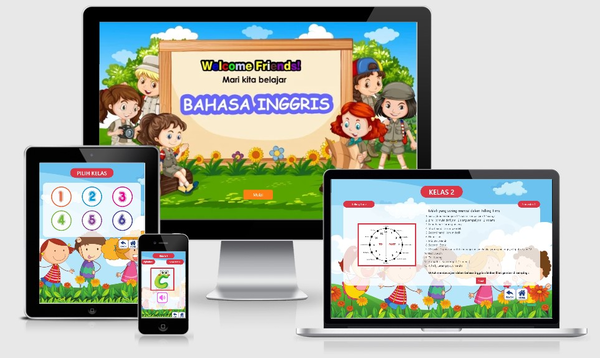

# SDAPP LEARNING - Belajar Bahasa Inggris

_**SDApp Learning** - Belajar Bahasa Inggris_ adalah media pembelajaran Bahasa Inggris yang ditargetkan kepada siswa SD kelas 1 hingga kelas 6.

_Dibuat oleh Mahasiswa Semester 4 sebagai salah satu pemenuhan tugas Mata Kuliah Software Development Project, Program Studi Teknik Informatika, Sekolah Tinggi Teknik Malang Tahun 2020._

> **ONLINE DEMO** => [SDApp Web](https://sdapp-learning-web.app)

# DAFTAR ISI

Repository ini berisi source code aplikasi SDApp Learning versi Windows Form dengan ekosisten .NET Framework 4.7.1, dibangun menggunakan bahasa pemrograman Visual Basic dan dengan Software Microsoft Visual Studio 2019.

- [SDAPP LEARNING - Belajar Bahasa Inggris](#sdapp-learning---belajar-bahasa-inggris)
- [DAFTAR ISI](#daftar-isi)
- [FITUR](#fitur)
- [INSTALLASI](#installasi)
  - [Panduan Untuk Pengguna](#panduan-untuk-pengguna)
    - [Prerequisite](#prerequisite)
    - [Langkah - Langkah](#langkah---langkah)
  - [Panduan Untuk Developer](#panduan-untuk-developer)
    - [Prerequisite](#prerequisite-1)
    - [Langkah - Langkah](#langkah---langkah-1)
  - [Penyimpanan Data Materi](#penyimpanan-data-materi)
- [LANGUAGE](#language)
  - [Visual Basic .NET 👁](#visual-basic-net-)
  - [TypeScript](#typescript)
- [SUPPORTED PLATFORM](#supported-platform)
    - [Web App](#web-app)
    - [Windows](#windows)
    - [Mac OS](#mac-os)
    - [Android](#android)
    - [IOS](#ios)
- [KONTRIBUTOR](#kontributor)
    - [Head Manager](#head-manager)
    - [Analyst](#analyst)
    - [UI/UX Designer](#uiux-designer)
    - [Developer](#developer)
    - [Quality Assurance](#quality-assurance)
- [PROGRESS](#progress)
- [LICENSE](#license)
- [CLOSING](#closing)

# FITUR

1. Menyediakan Materi yang dikhususkan untuk siswa kelas 1 - 6 SD
2. **Offline Ready**,
   Aplikasi ini dijalankan tanpa koneksi internet. sehingga dapat digunakan kapanpun tanpa perlu khawatir akan jaringan & koneksi.

# INSTALLASI

## Panduan Untuk Pengguna

### Prerequisite

Aplikasi ini berjalan dengan menggunakan Windows Form, sehingga agar aplikasi dapat terinstall dan dijalankan dengan baik, diperlukan beberapa Requirement, diantaranya :

- Menggunakan sistem operasi Windows 8.0 ke atas
- Memiliki ekosistem .NET Framework minimal versi 4.7.1 yang telah terpasang pada Sistem Operasi. Apabila belum ada, silahkan download & install terlebih dahulu `.NET Framework Runtime` pada halaman resmi [Microsoft Visual Studio](https://dotnet.microsoft.com/download/visual-studio-sdks)

### Langkah - Langkah

Setelah semua requirement terpenuhi, silahkan ikuti langkah-langkah berikut :

1. Download file **SDApp.zip** versi terbaru pada halaman [Release](https://github.com/AguzzTN54/SDApp/releases)
2. Extract file SDApp.zip dan jalankan file `setup.exe`
3. Lakukan instalasi seperti pada software biasa
4. Klik Finish dan aplikasi siap dijalankan

## Panduan Untuk Developer

### Prerequisite

Sebelum melakukan pengembangan terhadap aplikasi ini, terdapat beberapa requirement yang harus dipenuhi, yaitu :

- Menggunakan Sistem Operasi Windows sebagai paltform pengembangan
- Telah menginstall Microsoft Visual Studio
- Telah memiliki ekosistem .NET minimal versi 4.7.1, apabila belum, silahkan download dan install `.NET Developer Pack` terlebih dahulu melalui situs asli [Microsoft Visual Studio SDK](https://dotnet.microsoft.com/download/visual-studio-sdks)
- Memiliki Pengetahuan Tentang Visual Studio dan Visual Basic

### Langkah - Langkah

1. Clone Repository ini dengan command line `git clone https://github.com/AguzzTN54/SDApp.git` , atau jika belum menginstall git, bisa juga download dan ekstrak secara manual
2. Double click pada file `SDApp.sln`
3. Pada Tab Solution, klik kanan pada SDApp lalu pilih properties, ganti versi .NET Framework sesuai dengan versi yang telah terinstall, jangan gunakan .NET di bawah versi 4.7.1, karena belum mendukung WebView. apabila belum ada Framework yang sesuai
4. Dalam pengembangannya aplikasi ini membutuhkan tambahan Reference, yaitu `Markdig` dan `Webview`. kedua third party terebut telah termasuk dalam berkas yang didownload, bisa ditemukan pada folder `Resources/ContentReader`
5. Pada Tab Solution, klik kanan pada **Reference**, kemudian pilih **Add Reference**, kemudian cari berkas `Markdig.dll` untuk ditambhakan
6. Pada Tab Toolbox, klik kanan di ruang kosong tab tersebut, pilih **Choose Item**, kemudian klik tombol **Browse**, cari Berkas `Microsoft.Toolkit.Forms.UI.Controls.WebView.dll` di folder Content Reader. Tunggu bebrapa saaat, Centang Webview lalu Apply.
7. Aplikasi siap dikembangkan

## Penyimpanan Data Materi

Semua data materi mulai dari kelas 2 hingga kelas 6 berupa plain text yang disimpan dalam tabel Microsoft Office Access. Text Materi disimpan dalam dalam format `Markdown`. Ketika database mendapat request dari form, data akan diparse menjadi markup html, kemudian ditampilkan ke dalam Form melalui perantara `WebView`.

Interaksi antar Visual Studio dan Ms.Access dilakukan dengan tambahan runtime `Microsoft Access Database Engine 2015`. Runtime ini dapat diganti atau disesuiakan sesuai dengan kemampuan Developer.

# LANGUAGE

## Visual Basic .NET 👁

Aplikasi dibangun dengan Windows Form ekosistem .NET 4.7.2 menggunakan Softaware Visual Studio 2019.\
Versi ini dapat diinstall dan dijalankan pada Sistem Operasi Windows 10.

## TypeScript

Aplikasi dibangun berdasarkan konsep Progressive Web App & Trusted Web Activity menggunakan bahasa pemrograman Typescript yang berbasis Javascript dengan dukungan Library React JS dan Workbox.\
Aplikasi versi Javascript berjalan melalui browser sehingga dapat dijalankan di berbagai platform dengan baik\
Source Code & Demo Versi Web Aplikasi ini dapat diakses pada Repository [SDApp Web App](https://github.com/AguzzTN54/SDApp-Learning)

# SUPPORTED PLATFORM

Berdasarkan Issue _"[Alternaif untuk platform selain Windows #11](https://github.com/AguzzTN54/SDApp/issues/11)"_ Tim Developer merasa tertantang dan juga membangun aplikasi **SDApp Learning** yang dapat dijalankan dari berbagai platform. sehingga pengguna dapat merasakan pengalaman yang sama meskipun memiliki perbedaan operating sistem. Package Aplikasi untuk platform selain Windows dapat ditemukan pada halaman [Release](https://github.com/AguzzTN54/SDApp/releases) atau dapat dilihat di bawah ini

### Web App

Aplikasi dibangun menggunakan Bahasa Pemrograman Typescript kemudian dideploy ke Heroku untuk Back End dan Google Firebase Hosting untuk Front End. Meskipun merupakan berbasis web, Aplikasi ini tetap dapat dijalankan meskipun dalam keadaan offline. ini dapat terjadi atas dukungan dari library `Workbox`

Keunggulan dari Web Application ini, adalah dapat diakses dari berbagai platform tanpa perlu install mengisntall. Terlebih telah menerapkan konsep Progressive Web App sehingga dapat ditambahkan ke homescreen dan bersifat layaknya Aplikasi Native lainnya, baik pada Android, Windows, maupun IOS. Web Application ini dapat diakses melalui :\
[https://sdapp-learning.web.app](https://sdapp-learning.web.app)

### Windows

Selain Package yang dibangun dengan Visual Basic .NET, developer juga membuat Appx Bundle dan Universal Installer yang dapat diinstall dengan lebih mudah, tidak membutuhkan `.NET Framework Runtime` untuk digunakan, kedua versi tersebut dapat didownload melalui link di bawah :

1. [SDApp Learning.appx](https://github.com/AguzzTN54/SDApp-Learning/releases/download/v1.0-alpha/SDApp-windows10.zip) - Instalasi menggunakan Poweshell, ikuti tutorial berikut. [Install .Appx atau .AppBundle pada Windows melalui Powershell]()
2. [SDApp Learning.exe]() _Comming Soon_

### Mac OS

Versi ini merupakan hasil scale up dari SDApp Trusted Web Activity yang dibundle menjadi suatu package yang dapat diinstall pada Mac OS. Package ini dapat didownload melalui Link berkut :\
[SDApp Learning - Mac OS](https://github.com/AguzzTN54/SDApp-Learning/releases/download/v1.0-alpha/SDApp-macos.zip)

### Android

Kami juga menyadari bahwa tingkat penggunaan mobile device bagi anak anak usia SD lebih tinggi dibanding penggunaan Desktop Device. Selain itu Mobile device dirasa lebih praktis digunakan dimana saja. Terdapat 2 versi aplikasi yang dibangun oleh developer, yaitu versi _TWA / Custom Tab_ dan _Native_. keduanya bisa didapatkan melalui link berikut :

1. **TWA Version**\
   Versi TWA, merupakan hasil dari pengembangan SDApp Progressive Web App yang kemudian dibundle menjadi satu package yang dapat diinstall layaknya aplikasi Native lainnya. Versi TWA berjalan di atas browser Chrome, sehingga apabila Chrome tidak terinstall atau masih versi lawas, Versi TWA ini tidak akan berjalan dengan baik. Untuk mendownload versi ini, dapat melalui link berikut :\
   [SDApp - Learning_TWA.apk](https://github.com/AguzzTN54/SDApp-Learning/releases/download/v1.0-alpha/SDApp.apk)
2. **Native Version**\
   Dibangun Secara Native, berdiri sendiri, tidak terpengaruh aplikasi lain untuk dijalankan, support Android 6.0 ( Marsmallow ) ke Atas, Versi Native dapat didownload melalui link Berikut :\
   [SDApp Learning.apk]() _Comming Soon_

### IOS

Aplikasi IOS dan Android ( Native ), memiliki satu source code yang sama, hanya saja menjalani proses Production yang berbeda. Aplikasi untuk IOS dapat didownload melalui link berikut :\
[SDApp Learning.ipa]() _Comming Soon_

# KONTRIBUTOR

Aplikasi dibagun bersama Tim yang berjumlah 22 Mahasiswa dari kelas TI Semester 4 Tahun 2020 dengan rincian sebagai berikut :

### Head Manager

1. Iksanul Karim

### Analyst

1. Wildan ( Head )
2. Alvarisqi N
3. Andini
4. Arga
5. Bayu Laksana Aji
6. Indhika
7. Miranda D. A.
8. Reynaldi
9.
10. Veren

### UI/UX Designer

1. Haikal ( Head )
2. Faris
3. Abdulloh M. A.
4. Sila

### Developer

1. [Agustinus Y.](https://github.com/AguzzTN54) ( Head )
2. [Dimas E.](https://github.com/haidimas)
3. [M. Nabiel](https://github.com/Nabiel123)
4. [Venda](https://github.com/verielone)

### Quality Assurance

1. Aan Krisdianto
2. Diaztin
3. Yuri Ken

# PROGRESS

| Date            | Do                                |
| --------------- | --------------------------------- |
| `13 April 2020` | Menyusun TIM                      |
| `20 April 2020` | Menentukan Logo Tim               |
| `11 May 2020`   | Merancang Proyek                  |
| `14 Juni 2020`  | Merancang Desain Aplikasi         |
| `7 Juli 2020`   | Tahap Development ( VB.NET )      |
| `21 Juli 2020`  | Tahap Development ( PWA/TWA/Mac ) |
| `28 Juli 2020`  | Tahap Development ( Windows/Mac ) |
| `----`          | Tahap Development ( Android/IOS)  |
| `----`          | Tahap Production                  |
| `----`          | Quality Assurance                 |
| `----`          | Release Aplikasi                  |

# LICENSE

GPL-3.0

# CLOSING

Demikian Sedikit Penjelasan mengenai Aplikasi _**SDApp Learning** - Belajar Bahasa Inggris_ , Semoga dapat bermanfaat bagi pembaca atau siapapun yang terlibat, baik secara praktis maupun teoritis. Kami menyadari waktu pengerjaan aplikasi ini cukup singkat dan hasilnya jauh dari kata sempurna, untuk itu kami sangat mengharap [kritik dan saran](https://github.com/AguzzTN54/SDApp/issues/10) yang membangun sebagai bahan evaluasi kami dalam pengembangan project selanjutnya.

Selain kritik dan saran pembaca/pengguna dapat juga melakukan submit issue ketika menemukan masalah pada aplikasi ini pada Halaman [Submt Issue](https://github.com/AguzzTN54/SDApp/issues) ini.

Akhir Kata kami Ucapkan Terimakasih
